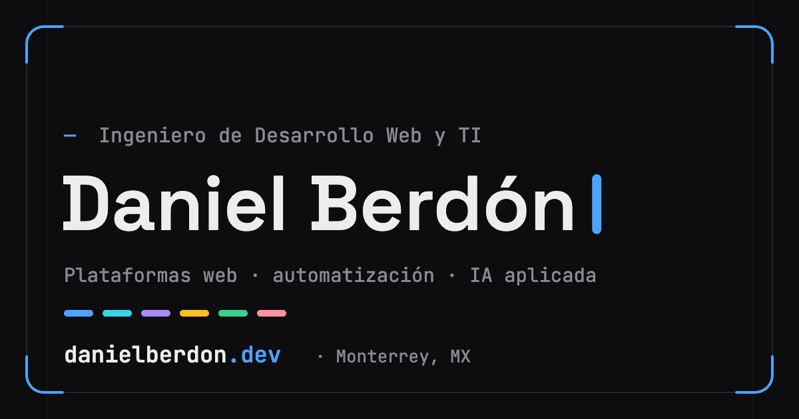

<div align="center">

# danielberdon.dev

Mi sitio personal: portafolio, trayectoria y notas técnicas.

[](https://danielberdon.dev)




</div>

## Cómo está hecho

**Estático de verdad.** Astro lo compila todo a HTML. No hay servidor que
mantener ni base de datos que respaldar: el sitio son archivos.

**El contenido no vive en el marcado.** Proyectos, puestos y entradas del blog
son Markdown con el frontmatter validado por Zod. Si a un proyecto le falta el
año, el build falla — en vez de publicarse con un hueco.

**CSS propio, sin framework.** Paleta, escala tipográfica, radios y curvas de
easing salen de un solo archivo de tokens. Claro y oscuro son dos diseños
calibrados aparte, no uno invertido.

**El movimiento no sostiene nada.** anime.js anima, pero el HTML se sirve
visible y cada efecto comprueba `prefers-reduced-motion` antes de tocar nada.
Sin JavaScript el sitio se lee igual.

**Cero peticiones a terceros.** Fuentes self-hosted, iconos insertados como SVG
durante el build, sin analítica ni rastreadores.

Y hay un código Konami escondido.

## Estructura

```
src/
├─ content/   proyectos, trayectoria, capacidades y blog, en Markdown
├─ data/      identidad y datos del sitio
├─ i18n/      textos de interfaz
├─ styles/    tokens de diseño y estilos globales
├─ scripts/   lógica (site.js) y animación (motion.js)
└─ pages/     rutas
```

## Licencia

El código es [MIT](LICENSE): cógelo si te sirve.

El contenido —textos, imágenes, entradas del blog y el CV— es © Héctor Daniel
Berdon Carrillo, todos los derechos reservados.
